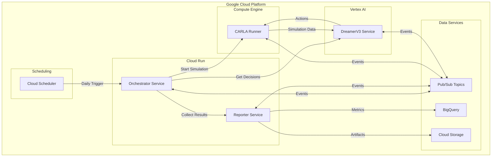

# Design Document

## Overview

The "Cars with a Life" system implements a distributed, cloud-native architecture for autonomous vehicle experimentation. The system leverages Google Cloud Platform services to orchestrate daily experiments combining CARLA simulation, AI-driven world models, and comprehensive evaluation pipelines.

The architecture follows microservices patterns with event-driven communication, ensuring scalability, reliability, and maintainability. All components are containerized and deployed using Infrastructure-as-Code principles.

## Architecture

### High-Level Architecture



### Component Architecture

#### 1. CARLA Runner (Compute Engine GPU)
- **Purpose**: Headless CARLA simulation with preloaded datasets
- **Technology**: Docker container on GPU-enabled Compute Engine
- **Datasets**: CARLA maps, OSM data (via osm2xodr), nuScenes integration
- **Communication**: REST API + Pub/Sub events

#### 2. DreamerV3 Service (Vertex AI)
- **Purpose**: AI world model for autonomous driving decisions
- **Technology**: DreamerV3 or CarDreamer wrapped as REST API
- **Deployment**: Vertex AI custom prediction endpoint
- **Input**: CARLA simulation state, sensor data
- **Output**: Driving actions, decisions

#### 3. Orchestrator Service (Cloud Run)
- **Purpose**: Experiment coordination and workflow management
- **Technology**: Python/FastAPI microservice
- **Responsibilities**: 
  - Daily experiment initialization
  - Component coordination
  - Experiment lifecycle management
  - Event orchestration via Pub/Sub

#### 4. Reporter Service (Cloud Run)
- **Purpose**: Data collection, evaluation, and reporting
- **Technology**: Python microservice with data processing libraries
- **Responsibilities**:
  - Autonomous note generation and validation
  - Evaluation metrics calculation
  - Report generation and storage

## Components and Interfaces

### Service Interfaces

#### CARLA Runner API
```
POST /simulation/start
  - Body: {scenario_config, map_name, weather_conditions}
  - Response: {simulation_id, status}

GET /simulation/{id}/state
  - Response: {vehicle_state, sensor_data, environment_state}

POST /simulation/{id}/action
  - Body: {steering, throttle, brake, gear}
  - Response: {action_result, new_state}

DELETE /simulation/{id}
  - Response: {cleanup_status}
```

#### DreamerV3 Service API
```
POST /predict
  - Body: {simulation_state, sensor_data, context}
  - Response: {actions, confidence, reasoning}

GET /model/status
  - Response: {model_version, health, capabilities}

POST /model/update
  - Body: {new_model_path}
  - Response: {update_status}
```

#### Orchestrator Service API
```
POST /experiment/start
  - Body: {experiment_config}
  - Response: {experiment_id, status}

GET /experiment/{id}/status
  - Response: {current_phase, progress, components_status}

POST /experiment/{id}/stop
  - Response: {cleanup_status, final_results}
```

#### Reporter Service API
```
POST /notes/generate
  - Body: {simulation_data, actions_taken}
  - Response: {autonomous_note, validation_status}

POST /evaluation/calculate
  - Body: {experiment_results}
  - Response: {metrics, accuracy_scores}

POST /report/generate
  - Body: {experiment_id, metrics}
  - Response: {report_url, storage_location}
```

### Pub/Sub Event Schema

#### Topics and Message Types
```
experiment-lifecycle:
  - experiment.started
  - experiment.completed
  - experiment.failed

simulation-events:
  - simulation.initialized
  - simulation.step_completed
  - simulation.terminated

ai-decisions:
  - decision.requested
  - decision.generated
  - decision.applied

evaluation-events:
  - note.generated
  - note.validated
  - metrics.calculated
```

## Data Models

### Core Data Structures

#### Experiment Configuration
```python
@dataclass
class ExperimentConfig:
    experiment_id: str
    scenario_name: str
    map_name: str
    weather_conditions: WeatherConfig
    duration_minutes: int
    evaluation_criteria: List[str]
    ai_model_version: str
```

#### Simulation State
```python
@dataclass
class SimulationState:
    timestamp: datetime
    vehicle_position: Coordinates
    vehicle_velocity: Vector3D
    sensor_data: SensorReadings
    traffic_state: TrafficInfo
    weather_state: WeatherInfo
```

#### Autonomous Note
```python
@dataclass
class AutonomousNote:
    timestamp: datetime
    location: str
    action: str
    destination: str
    confidence: float
    validation_status: ValidationResult
    map_reference: MapReference
```

#### Evaluation Metrics
```python
@dataclass
class EvaluationMetrics:
    experiment_id: str
    location_accuracy: float
    action_accuracy: float
    destination_accuracy: float
    note_count: int
    validation_success_rate: float
    overall_score: float
```

### BigQuery Schema

#### Experiments Table
```sql
CREATE TABLE experiments (
  experiment_id STRING NOT NULL,
  start_time TIMESTAMP NOT NULL,
  end_time TIMESTAMP,
  scenario_name STRING NOT NULL,
  map_name STRING NOT NULL,
  status STRING NOT NULL,
  ai_model_version STRING NOT NULL,
  total_notes INT64,
  overall_score FLOAT64
);
```

#### Notes Table
```sql
CREATE TABLE autonomous_notes (
  note_id STRING NOT NULL,
  experiment_id STRING NOT NULL,
  timestamp TIMESTAMP NOT NULL,
  location STRING NOT NULL,
  action STRING NOT NULL,
  destination STRING NOT NULL,
  confidence FLOAT64,
  validation_status STRING NOT NULL,
  location_accuracy FLOAT64,
  action_accuracy FLOAT64,
  destination_accuracy FLOAT64
);
```

#### Metrics Table
```sql
CREATE TABLE evaluation_metrics (
  experiment_id STRING NOT NULL,
  metric_name STRING NOT NULL,
  metric_value FLOAT64 NOT NULL,
  calculation_time TIMESTAMP NOT NULL,
  metadata JSON
);
```

## Error Handling

### Error Categories and Strategies

#### 1. Infrastructure Errors
- **Compute Engine failures**: Automatic instance restart, experiment retry
- **Vertex AI endpoint errors**: Fallback to backup model, graceful degradation
- **Cloud Run cold starts**: Pre-warming strategies, timeout handling

#### 2. Simulation Errors
- **CARLA crashes**: Automatic restart with state recovery
- **Invalid scenarios**: Validation before execution, fallback scenarios
- **Resource exhaustion**: Resource monitoring, automatic scaling

#### 3. AI Model Errors
- **Prediction failures**: Retry logic, fallback to rule-based decisions
- **Model loading errors**: Health checks, model version rollback
- **Timeout errors**: Async processing, circuit breaker patterns

#### 4. Data Processing Errors
- **Note validation failures**: Manual review queue, confidence thresholds
- **Metric calculation errors**: Data integrity checks, partial result handling
- **Storage failures**: Retry with exponential backoff, multiple storage locations

### Error Recovery Mechanisms

```python
class ErrorRecoveryManager:
    def handle_simulation_error(self, error: SimulationError):
        if error.is_recoverable():
            return self.restart_simulation_with_checkpoint()
        else:
            return self.terminate_experiment_gracefully()
    
    def handle_ai_model_error(self, error: ModelError):
        if error.retry_count < MAX_RETRIES:
            return self.retry_with_backoff()
        else:
            return self.switch_to_fallback_model()
```

## Testing Strategy

### Testing Levels

#### 1. Unit Testing
- **Service Logic**: Individual component functionality
- **Data Models**: Serialization, validation, transformations
- **API Endpoints**: Request/response handling, error cases
- **Coverage Target**: 80% code coverage minimum

#### 2. Integration Testing
- **Service Communication**: API interactions, Pub/Sub messaging
- **Database Operations**: BigQuery queries, Cloud Storage operations
- **External Dependencies**: CARLA API, Vertex AI endpoints

#### 3. End-to-End Testing
- **Complete Experiment Workflow**: Full pipeline execution
- **Error Scenarios**: Failure recovery, graceful degradation
- **Performance Testing**: Load testing, resource utilization

#### 4. Cloud Infrastructure Testing
- **Deployment Validation**: Infrastructure provisioning
- **Service Health Checks**: Monitoring, alerting
- **Disaster Recovery**: Backup and restore procedures

### Testing Infrastructure

```yaml
# Test Environment Configuration
test_environment:
  carla_instance: "e2-standard-4-gpu"
  vertex_ai_endpoint: "test-dreamer-endpoint"
  cloud_run_services: "test-orchestrator, test-reporter"
  test_datasets: "carla-test-maps, nuscenes-mini"
```

### Continuous Testing Pipeline

1. **Pre-deployment**: Unit and integration tests
2. **Staging Environment**: End-to-end validation
3. **Production Monitoring**: Health checks, performance metrics
4. **Automated Rollback**: On critical failure detection

## Deployment Architecture

### Infrastructure Components

#### 1. Compute Resources
- **CARLA Runner**: n1-standard-8 with NVIDIA T4 GPU
- **Orchestrator**: Cloud Run (1-10 instances, 2 CPU, 4GB RAM)
- **Reporter**: Cloud Run (1-5 instances, 1 CPU, 2GB RAM)
- **DreamerV3**: Vertex AI custom prediction (auto-scaling)

#### 2. Storage and Data
- **BigQuery**: Multi-region dataset for analytics
- **Cloud Storage**: Regional buckets for artifacts
- **Pub/Sub**: Global topics with message retention

#### 3. Networking and Security
- **VPC**: Private network for internal communication
- **IAM**: Service-specific roles and permissions
- **Secrets Manager**: API keys, database credentials

### Deployment Pipeline


This design provides a robust, scalable foundation for the "Cars with a Life" experiment system, ensuring reliable daily operations while maintaining flexibility for future enhancements.